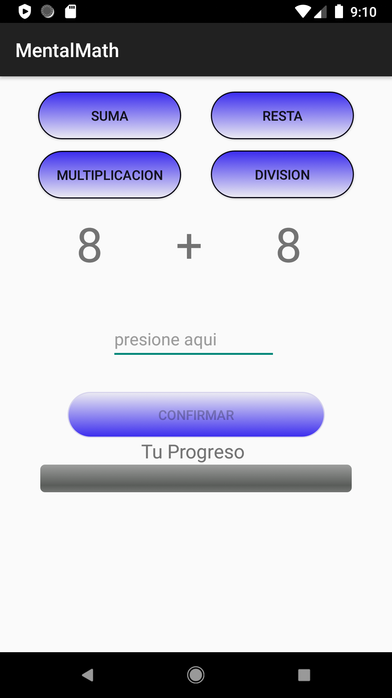
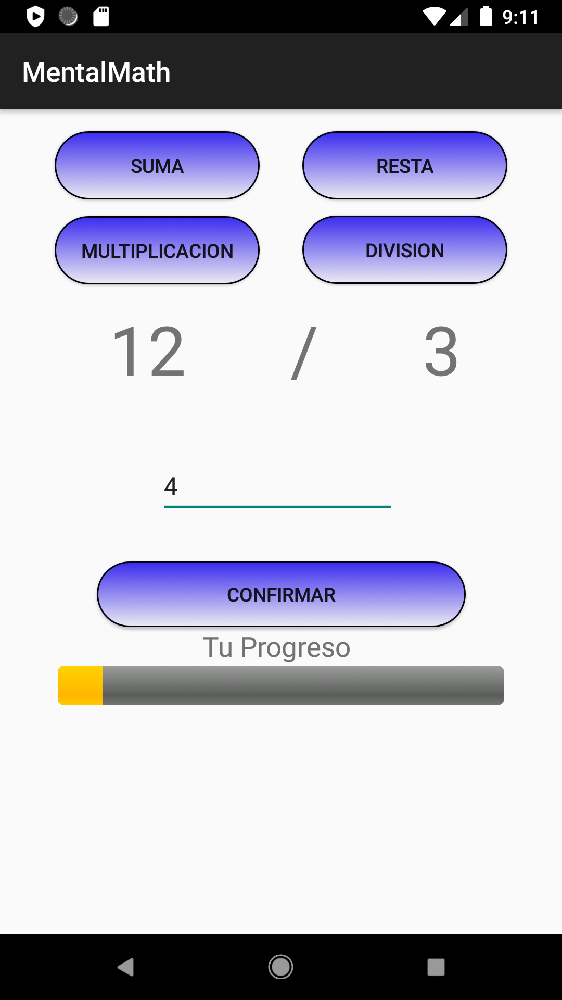
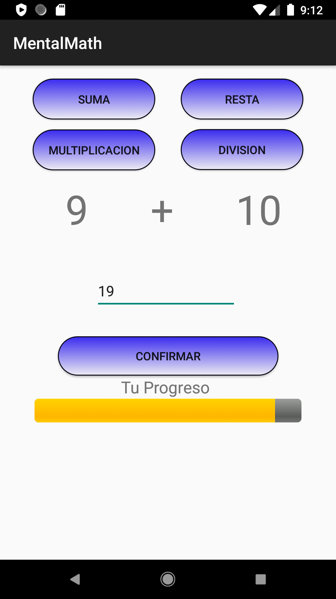
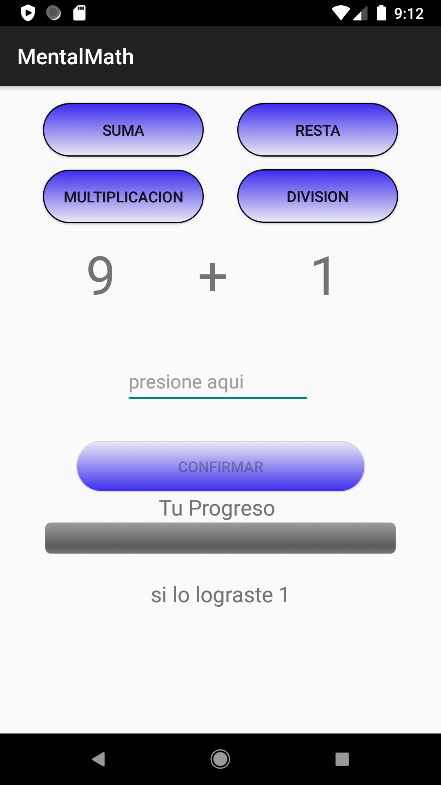

# LearnToMath
<h2>LearnToMath</h2>
<h4>MentalhMath</h4>

Es una aplicacion para niños, poder resolver cuentas mentalmente

Para suma y resta los numero van del rango 0 a 10

Debes ingresar un numero, para poder verificar

Para multiplicacion y division es hasta la tabla del 3

Se muestra el progreso y se resetea cuando lo cumple y indica cuantas veces lo superaste

